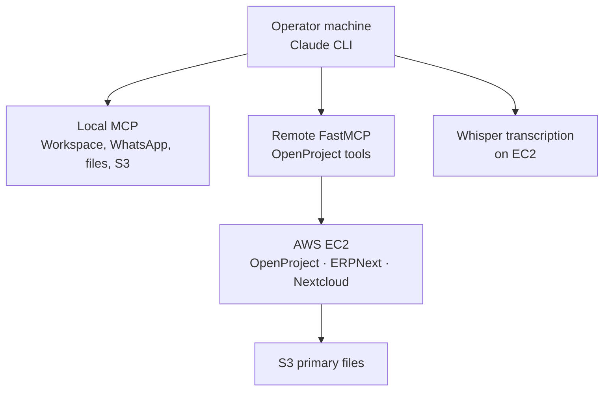

# Sovereign AI Operations

A working AI operations stack for a fractional CTO practice. Claude Code on the operator's machine, local and remote [Model Context Protocol](https://modelcontextprotocol.io) servers, Whisper transcription on AWS, and a self-hosted core of OpenProject, ERPNext, and Nextcloud.

This is the system behind the [Autonomic PMO case study](https://ctorescues.com/autonomic-pmo/) on CTO Rescues. It is production infrastructure for one practice, published so a leadership team can see what "AI in the operating cadence" looks like when the data stays inside a boundary you control.

Daniel Brody · [Fractional CTO profile](https://github.com/dzbrody) · [ctorescues.com](https://ctorescues.com/)

## Problem

Executive work fragments across mail, chat, calendar, project boards, and meeting recordings. A person becomes the integration layer: copying action items, missing commitments, and losing the thread across companies. Hosted copilots make that faster and move the same material into someone else's tenant.

The operating problem is latency and omissions. The architecture problem is that the assistant has to reach the systems of record and still leave a trail a board can live with.

## Solution

The repository separates three things that teams usually tangle together.

| Layer | What it is | Why it matters in an enterprise rollout |
| --- | --- | --- |
| Local prompts and skills | `.claude/commands/`, `scheduled-tasks/` | The operating procedure can change without rebuilding a container. |
| MCP servers | Local stdio servers plus a remote FastMCP server | Each system of record is a tool with its own credential, not a prompt that contains a password. |
| Self-hosted core | OpenProject, ERPNext, Nextcloud on AWS, Docker, Terraform | Projects, files, and ERP stay on infrastructure the operator accounts for. |

Patterns a buyer can inspect in this tree:

- **MCP integration.** Local servers for Google Workspace, WhatsApp (via a Go bridge), filesystem, document loading, S3, and browser automation. A remote FastMCP server exposes OpenProject tools over SSE. Inventory: [mcp-servers/README.md](mcp-servers/README.md).
- **Prompt and skill decoupling.** Scheduled briefings and slash commands are Markdown and local configuration. Changing a briefing does not require an image rebuild. See `scheduled-tasks/` and `.claude/commands/`.
- **Whisper transcription.** `/transcribe` sends audio or video from S3, Drive, or a Meet URL to Whisper on EC2. The case study describes the deployed model as faster-whisper at INT8. Confirm the current server path under `mcp-servers/` before quoting a model setting.
- **Agent skills.** Morning briefing, evening wrap-up, weekly review, deduplication, time entry from calendar, backlog hygiene, and meeting-note ingest. The command list is `.claude/commands/`.



Operator detail that used to open this README now lives in the existing docs. Read those for install steps, briefing contents, and the Nextcloud deploy:

| Document | Use it for |
| --- | --- |
| [mcp-servers/TEAM-INSTALL.md](mcp-servers/TEAM-INSTALL.md) | New-machine setup |
| [mcp-servers/README.md](mcp-servers/README.md) | Server inventory |
| [scheduled-tasks/README.md](scheduled-tasks/README.md) | Briefing prompts |
| [infrastructure/README.md](infrastructure/README.md) | Terraform and EC2 |
| [docs/nextcloud-deployment.md](docs/nextcloud-deployment.md) | Nextcloud CE, S3, Postgres, Redis, OpenProject OAuth |
| [docs/OPERATIONS.md](docs/OPERATIONS.md) | Command matrix and briefing behavior |

This file is the front door. Install steps and the day-to-day command matrix are in the docs above.

## Getting started

Prerequisites: Node, `uv`, the AWS CLI, Go, and Claude Code.

```bash
git clone https://github.com/dzbrody/claude-assistant-config.git ~/.claude-assistant
# Follow mcp-servers/TEAM-INSTALL.md from here.
# Register servers with mcp-servers/install-all.sh
# Copy .claude/settings.local.json.example and fill credentials locally.
```

`.claude/settings.local.json` is gitignored and holds API keys and machine paths. Keep it that way. The remote MCP endpoint and its key belong in a password manager, passed in at registration time.

Run a briefing only after the install guide has been completed:

```bash
bash ~/.claude-assistant/scripts/run-scheduled-task.sh morning-briefing
```

## How this maps to a client mandate

| Pattern in this repo | Engagement it supports |
| --- | --- |
| MCP as the only path to mail, chat, projects, and files | AI adoption that does not paste client data into an unaccountable SaaS tenant |
| Prompts and skills kept out of the image | A leadership team can change the operating procedure without a platform release |
| Whisper beside the project system | Meeting audio becomes tasks in the system of record |
| Nextcloud on S3, Postgres, and Redis, with OAuth to the project system | Sovereign file storage for a regulated or government-facing environment |
| Terraform next to the containers | The platform can be explained, rebuilt, and diligenced |

The same patterns are what I implement under **AI & Platform Modernization** at [CTO Rescues](https://ctorescues.com/): cloud on AWS, Azure, or GCP, an AI-enabled operating system, and governance that survives a board pack.

## Tech stack

- Claude Code and Claude CLI
- Model Context Protocol (stdio and SSE), FastMCP, Python
- faster-whisper transcription
- WhatsApp bridge (Go), Google Workspace MCP
- Docker, Terraform, AWS EC2 (arm64), S3, Route 53, SES
- OpenProject, ERPNext, Nextcloud CE, PostgreSQL, Redis, nginx

## License and contributions

Licensed under the [GNU Affero General Public License v3.0](LICENSE). Network use of a modified version carries the AGPL source-sharing duty. Read that before embedding this stack in a hosted product.

Contributions: bug fixes and documentation corrections as pull requests. Do not commit secrets, customer data, or machine-specific paths. New MCP servers should arrive with a row in `mcp-servers/README.md` and a note in `TEAM-INSTALL.md`.

## Work with me

If your leadership team is still the integration layer between mail, chat, and the project system, this repository is the reference architecture I run myself.

[Book a Fractional CTO call](https://ctorescues.com/contact/) · [Autonomic PMO case study](https://ctorescues.com/autonomic-pmo/) · [LinkedIn](https://www.linkedin.com/in/danielbrody/) · [GitHub profile](https://github.com/dzbrody)


---
**CITO for Hire** — design-it · sell-it · build-it · implement-it
[ctorescues.com](https://ctorescues.com) · [Facebook](https://www.facebook.com/people/CTORescues/100067231596849/) · [GitHub](https://github.com/dzbrody) · [LinkedIn](https://www.linkedin.com/in/danielbrody/)
